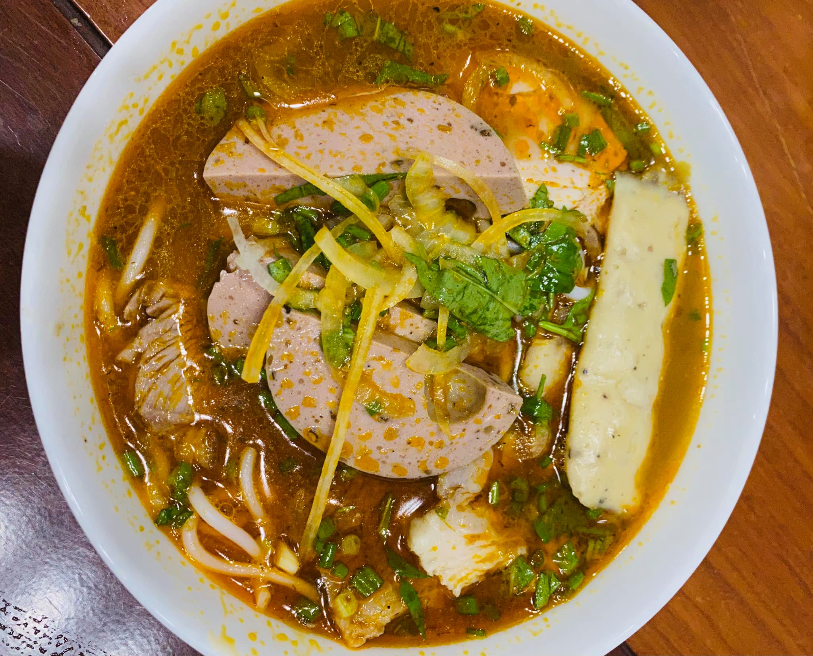

{width="100%"}

It's the beginning of another average afternoon in the small village of
Ðồng Nai, Vietnam. The sun shone with a scorching radiance that would
compel any passerby to indulge themselves in the luxurious shade of the
many alligator-apple trees lining the sides of the gentle riverbank.
Particularly hungry Sunday strollers would often pick armfuls of those
delectable fruits, drawn by the light, sweet, green apple scent that
wafted through the air. With satisfied smiles and homemade palm leaf
baskets overflowing with fresh treasures, they would continue their
paths towards home. Just across the river sat a humble food stall and a
small, serious woman who owned it. Hardly anyone could resist the
pungent, nutty aromas of fermented shrimp paste and zesty, citrus scents
of lemongrass that emanated from Mrs. Lan's bún bò stall. Young couples
and families alike frequented her business for a warm bowl of it, no
matter the time of year. Those who had never tried her bún bò could not
help but have their curiosity piqued by the waves of customers that
flocked to Mrs. Lan's stall each day.

Mrs. Lan lived but just five minutes down the road from her food stall
with her daughter, Hanh, and her son, Truong. Despite living so close to
the business that she poured every ounce of energy into, she still rose
at dawn each morning with the crowing of the rooster to carry the
weighty buckets of bún bò broth down to the river. Armed with her trusty
bamboo pole on her shoulders, Mrs. Lan would deliver pounds and pounds
of the soup that she slaved over to her stand. Beside her always was her
young daughter, Hanh, with arms full of rustic bamboo chairs for their
customers to sit and enjoy their meal by the sweeping stream. Day after
day, Mrs. Lan and Hanh would start their morning walk to their stall to
begin a long, fruitful day of work. Serving bowl upon bowl of bún bò to
their eager customers, the two of them were an unstoppable team. Every
minute of their busy day was spent taking orders, washing dishes, and
feeding the people of Ðồng Nai. Strangely enough, the only one never
seen helping the family bún bò business was Mrs. Lan's son, Truong.

For the past year, Hanh could not help but notice that something in her
perfectly routine life was off. She had lived the same day again and
again since the time that she could walk, only now did she realize that
time had taken its toll on her mother. Waking up before the sun and
working until dark was something that Hanh always saw as normal, she
never thought she would live to see her mother so worn down and tired.
Mrs. Lan's hands ached like never before, she couldn't carry nearly as
much on her shoulders as she used to, and her mother wore a smile that
just barely hid the weariness behind her eyes. Hanh knew that her mother
could not keep up this life forever, but she also knew that her mother
had every intention of going until her last breath and passing her
life's work onto Truong. Worried about what would become of the business
once it fell into her brother's careless hands, Hanh wanted to voice her
concerns as directly as she could. So, after months of deliberation and
hesitation, she finally decided to approach her mother about the future
of the business.

"Mom, I have to ask you a question," Hanh said.

Her mother brushed her off with nothing more than a swat of her hand.
"Not now, Hanh! Don't you see how busy I am?" She furrowed her brow as
her calloused hands nimbly ladled the steaming broth into bowls.

Hanh frowned, she suddenly spurted out what had been weighing on her
mind, "What does Truong have that I don't? He doesn't even bother to
help us; can't you see the way he wastes his life?"

Her daughter's assertive question caught Mrs. Lan off guard, and she
began to feel the prickles of annoyance swell into anger. "Not now." she
repeated firmly.

After hiding her true thoughts for so long, there was no way Hanh could
let the issue go. Now that she had finally pulled together the courage
to ask something so bold of her mother, her mouth and mind were like a
faucet that could not possibly turn off. "Mom!" Hanh spouted, "I've
spent every day of my life watching you; I know how hard we struggle to
get by. I mastered the secret bún bò family recipe so that I could help,
and yet I am the only one who cares and he's not here. I should not be
the only one that knows this is not fair! We work too hard to bring home
the money that he turns around and burns on drinking and gambling."

"So, what if he drinks? So, what if he gambles?" Mrs. Lan snapped. "He's
the only legitimate son that this family has."

At the sound of this, Hanh couldn't help but laugh in disbelief, "Oh, so
he's exempts because he's the 'legitimate son'? Grandmother didn't seem
to care about the legitimate son or anyone else when she kicked us out
of the house after father died."

"Hanh! ---" Her mother began to raise her voice but was quickly silenced
by a knot in her throat. Her eyes pooled with tears as she recalled
flashbacks from the day her family was cast out on the streets.

Ms. Lan always knew that Mr. and Mrs. Tran, the wealthiest landowners in
the area, would never allow their son to marry her. The fact that their
son fell in love with a maid such as herself brought shame to their
family. When Ms. Lan announced that she was with child, the Tran family
did everything in their power to keep the news from getting out. She
obeyed every demand they had, but when she bore them their grandson and
natural heir, Truong, a cold indifference developed. When they welcomed
their daughter, their indifference simply grew. The final straw came
with the death of the Tran family son, Ms. Lan's beloved. When he passed
away from a rare respiratory disease, his parents claimed that a fortune
teller had warned them of her evil influence. His parents threw them out
on the street in a heartbeat. With no money and no home, Ms. Lan and her
children wandered far away, leaving their tragedy behind.

When she felt her tears fall to her cheeks she snapped back into
reality. "...You can't talk to me like this."

"I have been nothing but respectful and helpful to you all my life,"
Hanh said. "But you still treat me like I'm in the way! I am your
daughter, not your source of shame. Just because I was born a woman, and
I am not the man of the house, doesn't mean I don't have what it takes
to run this business."

Her mother huffed as she busied her hands with the dirty bowls left by
previous customers. "I said not now, Hanh! Just stop. Enough is enough."

"You can't keep making excuses for him mom, especially not if you want
him to take over one day. We both know he doesn't care about it like I
do!"

"I said stop!" Mrs. Lan shouted. In her frustration, a porcelain bowl
slipped from her hands and shattered across the ground. Customers
surrounding the stand went silent, their eyes drawn to Mrs. Lan and
Hanh's standoff. Sensing a greater argument about to unfold, some
awkwardly slurped their noodles and left while others laid their money
on the counter without so much as touching a single chopstick to their
meal they had abandoned.

No one would have ever expected that it was the last time they could
enjoy Mrs. Lan's flavorful bowl of beef noodle soup while admiring the
peaceful riverside scenery. Rumor has it that Hanh killed her mom in
anger later that night and ran away. Mr. Tam, a frequent customer, who
lived near Mrs. Lan insisted that he heard her cry out her daughter's
name, "Hanh", followed by a chilling, "Don't do it! This is all yours".
Then nothing but silence.

"No way she could have done it," argued Mrs. Trang. "She has always been
such a sweetheart."

"She nourished a viper in her bosom. Did you not hear about their fight
earlier that day?" another neighbor chimed in.

But the truth is, her son Truong had been at the end of a frayed rope
for quite some time. After the loss of his father and a childhood spent
trying to teach himself the ways of a family man, he fell into the vices
of alcohol and gambling. These addictions controlled his life and molded
him into a person that could not stand to lose any more than he already
had. When he drank, his bitter demeanor turned to violent rage. Even
worse, when he lost a bet, his rage was nearly uncontrollable and his
thirst for money was unquenchable.

One night, particularly on edge from a night of losing bets in a cock
fighting ring, an intoxicated Truong came back in a belligerent state.
The neighbors did not know it was him who caused such a scene when he
went inside and started to fling things all over the house in search of
money.

That night, Hanh woke up from the loud crashes and thuds coming from the
rest of the house. At the same time, Mrs. Lan woke up to see what could
have possibly been going on. She rushed into the living room, fearing
there was an intruder in their house. When he saw his mother come in,
Truong lunged toward her and wrapped both hands around her neck. Shaking
with drunken rage, he was squeezing her neck and screaming, "Old hag!
Where is the money?"

Struggling to breathe, Mrs. Lan stuttered, "I-i don't have any more
m-money this month, we took a loss in profit! You won't see any for a
w-while."

Truong's face turned deep red as he gripped her neck tighter. "I don't
fucking care about your stupid bun bo stall, or whether you make a
profit or not! I want money!" He grunted, "NOW."

Although Hanh and her mother had not talked since the incident earlier,
she leapt to action and tried her best to pull Truong's hands off of
her. He jerked his hand when Hanh came near, sending her flying into the
cupboard. While next to it, Hanh grabbed a knife from the nearby table
and threatened Truong.

"Let go of mom, or I'm going to stab you!"

Truong directed his attention away from Mrs. Lan.

"Oh, look who's talking?"

He rushed toward his sister, grabbing for her wrist. He held on tightly
and quickly twisted it. The sharp pain was too much for her and Hanh
dropped the knife she had pointed at Truong. Their mother, who had
dropped to the floor while struggling for air, crawled across the ground
to hold Truong's leg.

Hoarsely she begged, "Please don't do it." Sadly, Truong did not care.
He picked up the knife from the floor and put it to Hanh's throat.

"Sister, you are very brave today."

Hanh spat on Truong's face. "Your worthless pig!"

Truong held the knife tighter and moved it closer to Hanh's throat, "Oh,
shut up, you lousy woman."

Mrs. Lan struggled, but kept hanging onto Truong's leg and begged him,
"It is all yours, everything, including the money and the business."

Truong bent down, plunging his knife through the air and stabbed Mrs.
Lan in her back several times. "If I were not the son of a lowlife like
you, I would be swimming in gold. The money and the business have always
been mine." 

Truong took a breath as he came closer to Mrs. Lan. He held her face,
stroked her hair and said, "Rest in peace mom, you daughter will join
you soon." Truong, then, looked over at the horrified Hanh.

With a jolt of energy, Mrs. Lan screamed out, "Hanh!"

Hanh turned to face her mother who, using her last breath, mumbled,
"...run".

Hanh tried her best to run throughout the field in the complete
darkness. After witnessing her mother's tragic death, Hanh had lost her
ability to talk. She was in a complete state of shock and no matter how
hard she tried; no noise came out of her mouth.

Hanh was fast, but Truong was even faster. He caught up to her and
pulled her long, silky hair like a cord, making her fall into the mud.
She prayed to Buddha, promising that if she could escape, she would
dedicate her life to helping other people.

Maybe it was pure luck, or maybe it was Buddha who helped her; but
during the struggle, her brother's feet were caught in a row of bamboo
spike traps that had been laid around the outside of a field. Covered in
waste and brush to prevent animals from eating the crops, Truong had not
seen the spikes until it was too late. He screamed out in pain, holding
the foot that had been punctured. Hanh took the opportunity to push his
foot further down the spike, leaving him immobile. She proceeded to pick
up the knife that Truong had dropped and stabbed him in the heart. She
stood and watched until he bled to death. When sunrise came and Truong
took his last breath, Hanh simply walked away. 

From that night on, no one knew where Hanh went, she simply disappeared.

 Far across the globe, in the land of opportunity, stands a humble
Vietnamese restaurant, "Lemongrass". It was only three in the morning
when a woman with smooth, shoulder-length hair slowly rose from her bed.
She tiptoes her way into the bathroom, afraid that she might wake up the
man lying next to her. Looking in the mirror, she finds several strands
of grey hair, stopping only to notice that at the outer edges of her
eyes, there were wrinkles. She gets dressed, remembering to kiss her
child in the room across from her own before leaving the house for the
day.

This bustling, new restaurant is in one of the strip malls ten minutes
down the road from her home. She carries bags and bags of fresh
ingredients; garlic, shallots, banana flowers, citrus, and greens inside
that had just been bought from the nearby store. Along with these
groceries, she also carries in a single bouquet of yellow daisies.

Grabbing a large aluminum pot from the rack, she continues to brew the
fragrant broth of lemongrass stalks, pig bones, beef shank and oxtail
that she had carefully prepared the night before. Next to this boiling
pot, a wok filled with vibrant, red annatto oil and sliced garlic and
shallots was creating a flavorful stir fry. She waited until she could
smell the zingy aroma from the sizzling pan to turn off the stove and
set it to the side. Afterwards, she gets out a bag of banana flowers to
slice above a bowl of cold water and squeezed lime. She tears bunches of
water spinach over another bowl of water while setting a pot of
vermicelli noodles to boil and drain. After five long hours, she has
finally done prepping her bun bo. The finishing touch on her dish is a
generous seasoning of salt, sugar, and spoonful of the earthy fermented
shrimp paste. Her kitchen was flooded with the complex scents of spicy
chilis, nutty broth, and bright citrus garnish.

Every day, before opening her restaurant doors to the people, she brings
a plate full of apples and a bundle of incense sticks as an offering to
the god of wealth to wish for plenty of customers. Today, however, is
more special than normal. After finishing her routine offering, she
brings her bouquet of yellow daisies and neatly arranges it in a
porcelain vase decorated with blue patterns. Then, she carries a ceramic
bowl of bun bo and neatly lays it on the altar next to the vase of
flowers. She kneels and with three incense sticks in her hand, she
prays, "Today marks the twentieth year since you passed away, I still
miss you every day." She looks around and continues on, "I opened my
very own restaurant last week and I named it 'Lemongrass', after the key
bun bo ingredient that you grew in the backyard. I have been very
successful with your recipe. I wish you were here to see for yourself
how successful the daughter you despised so much has become." 

Mrs. Lan's picture frame was neatly placed in the middle of the altar,
in the picture she was smiling.
