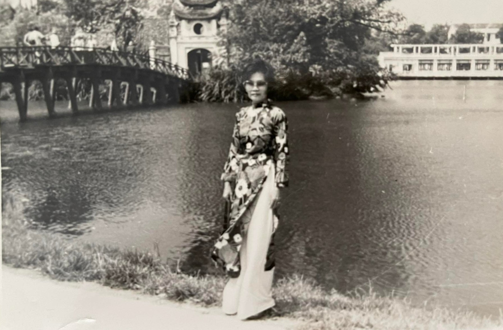
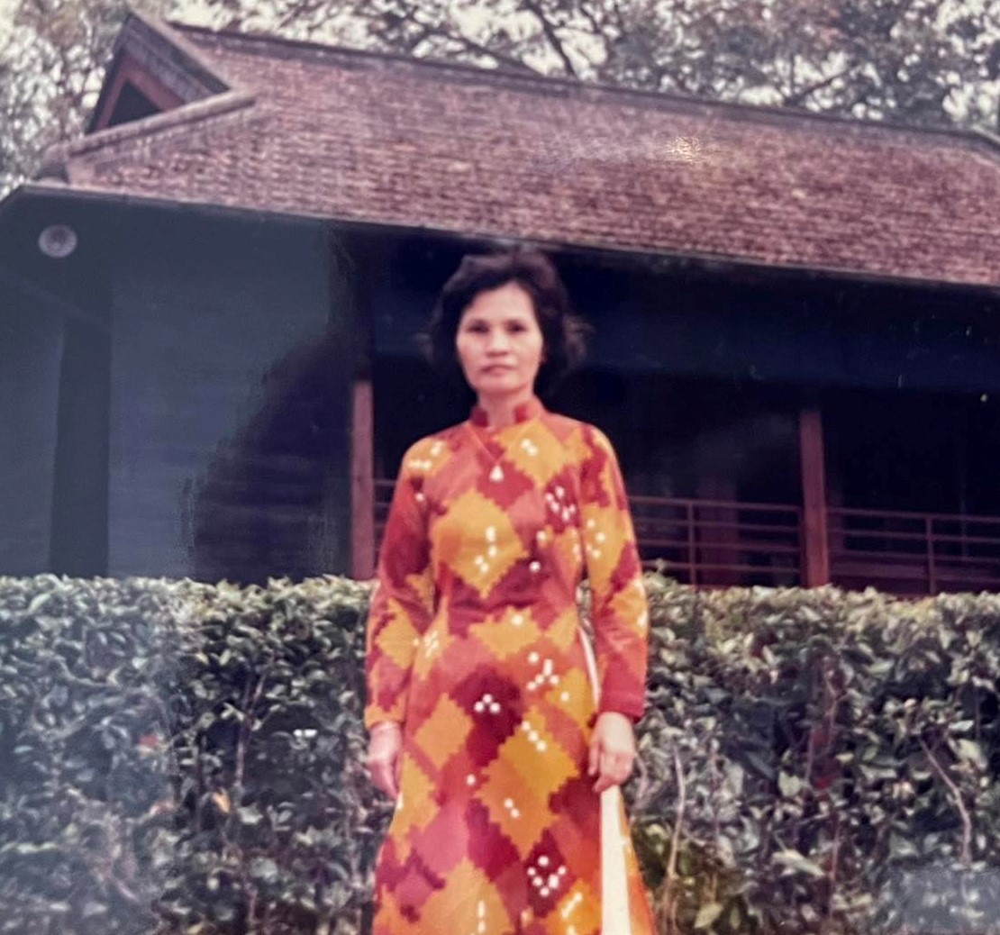

{width="50%"}

She whom I love, left me five  years ago

Memories remains, I cried with regret

She whom I love, I still cannot let go

Afterall, I still have not paid my debt.

Goodbye "ngoai", I wanted to say those words

But distance forbid, nothing was exchange

Time flew by fast, broken heart is uncured

Scrambled in my thought, I'm going insane.

The rustic hammock, alone in the house

Where are the young girl and her grandmother?

The sun scorched the roof, silence as a muse

Wander around, I miss my grandmother

Should have spend more time with her when I could

Grandma's loneliness, now I understood. 

{width="50%"}
