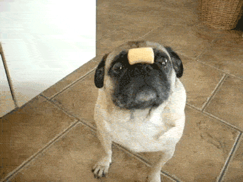

I walk around endlessly.

A little noise would startle me.

Where is everyone at?

When separation anxiety kicks in,

I howl.

When the front door opens,

I wag my tail and run up.

"Snort, snort, snort, snort,"

I lick everyone's face.

Love is in the air.

My stomach is grumbling.

Time to eat!

But where are my humans and where is my food?

Angrily, I bark.

"Ruff, Ruff," or I try to.

The menu for today is ground beef.

But with this flat face,

It is so hard to eat.

And yet, I devour the entire bowl.

Yum!

"Hooman, I want to play catch,"

Although I cannot run.

These short stubby legs

Are all tired after half a mile.

I whine.

When they are all home,

Life is good.

I love the cuddling on the sofa,

And how I would shed all over it.

Yippie!

It is so quiet around here again.

The keys are not on the hook.

I lay on the sofa all alone. Patiently,

waiting for them to come home.

Hopefully with more treats.

